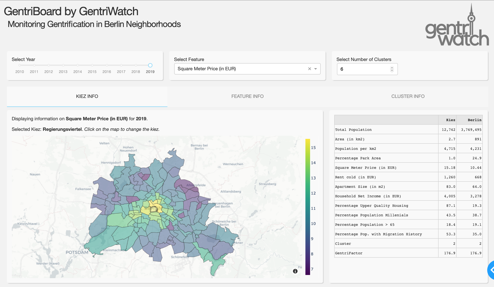

# GentriBoard by GentriWatch

An interactive Dashboard to monitor the [gentrification](https://en.wikipedia.org/wiki/Gentrification) in Berlin neighborhoods.



#

### Setup

Intall the requirements:
```bash
pip install -r requirements.txt
```

Clone the repository:
```bash
git clone https://github.com/ninathumser/GentriWatch.git
```

Run the webapp from your terminal:
```bash
python app.py
```
#

### Data processing

Data is freely available and taken from two main sources:
- Demographic and migration data for 2010 - 2019 taken from [Berlin Open Data](https://daten.berlin.de) by the City of Berlin
- Rent data for 2010 - 2019 taken from Wohnmarktreport by Berlin Hyp and CBRE (available at the [Digitale Landesbibliothek Berlin](https://digital.zlb.de/viewer/))
 
Raw data is mainly in '.xls' and '.pdf' format and converted to dataframes. 

These are then combined in [Combining_Dataframes](https://github.com/ninathumser/Gentrification/blob/master/Combining_Dataframes.ipynb) to generate 
- `dataframes/final_all.pkl`
- `dataframes/df_data.csv`
- `dataframes/df_clustering.csv`
- `dataframes/principal_components.csv`
- `dataframes/gentri_factor.csv`
- and several mapper dictionaries. 

This notebook does 
- heavier data cleaning (imputing missing values)
- feature engineering (frequency encoding, percentages, percentage changes)
- scaling for 11 main features
- principal component analysis
- calculation of the GentriFactor.

#
### Predicting the GentriFactor for 2020
 
In [GentriFactor_cng_t-1_XGB](https://github.com/ninathumser/Gentrification/blob/master/GentriFactor_cng_t-1_XGB.ipynb)
we use [XGBoost](https://xgboost.readthedocs.io/en/latest/) to predict the one year percentage change of the
GentriFactor.
The notebook does
- time lag calculation
- target encoding
- scaling
- train and test split
- hyper parameter tuning.